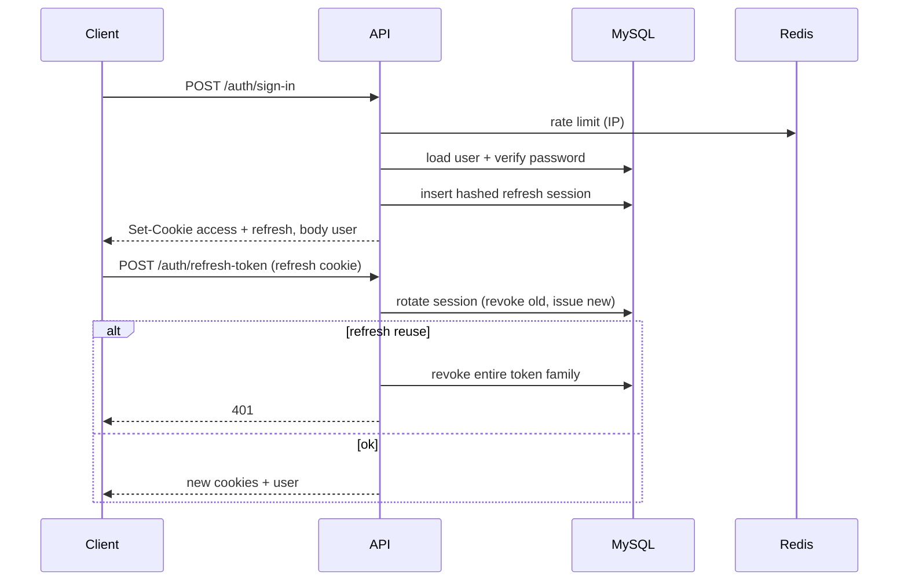

# Elysia API Boilerplate

Production-ready API starter with **Elysia** and **Bun**: MikroORM on MySQL, JWT cookie auth with refresh-token rotation, Redis rate limiting, and a layered architecture you can clone as a starting point.

Use it as a template for new backends — or as a reference for how a small, strict TypeScript API is structured.

[](https://bun.sh)
[](https://elysiajs.com)
[](https://www.typescriptlang.org)
[](https://www.mysql.com)
[](https://redis.io)
[](https://www.docker.com)

---

## Why this boilerplate

Most Elysia starters stop at “hello world”. This one ships the pieces you actually copy into real projects:

- Auth that uses **httpOnly cookies** (`__Host-accessToken` / `__Host-refreshToken`), not tokens in localStorage
- **Refresh-token rotation** with reuse detection (token families)
- A **repository + service** layer on MikroORM, not queries in controllers
- Docker Compose for API, MySQL 8 and Redis 7 — `docker compose up` and you are running

Vendor extras (payments, storage, mail) stay **out** of this repo on purpose. Install them only in the projects that need them.

---

## Features

| Area | What you get |
| --- | --- |
| **Runtime** | Bun, TypeScript strict, path aliases (`@auth/*`, `@user/*`, `@core/*`, …) |
| **HTTP** | Elysia controllers, CORS with credentials, typed DTOs (`TypeBox`) |
| **Auth** | Sign-up, sign-in, sign-out, refresh. JWT access + opaque refresh token |
| **Sessions** | Refresh tokens hashed (HMAC-SHA256), stored in MySQL, rotated per request |
| **Passwords** | `Bun.password.hash` / `verify` (no extra crypto library) |
| **Rate limit** | Redis, per IP — sign-up / sign-in **10 / 15 min**, refresh **30 / 15 min** |
| **Data** | MikroORM 7 + MySQL, `EntitySchema`, migrations CLI |
| **Request scope** | `RequestContext` fork per request — no leaked EntityManager |
| **Users** | CRUD with search, pagination, sort; roles `ADMIN` / `USER` |
| **Errors** | Typed HTTP errors (`401`, `403`, `404`, `409`, `429`) and a global handler |
| **Multi-tenant helpers** | `UserScopedBaseService` to scope queries by `user_id` |
| **Ops** | Multi-stage Dockerfile (`dev` / `migrator` / `production`) + Compose for local |

---

## Stack

```
Elysia  →  JWT cookies  →  Services  →  Repositories  →  MikroORM  →  MySQL
                │
                └── Redis (rate limit)
```

| Layer | Choice |
| --- | --- |
| Runtime | [Bun](https://bun.sh) |
| Framework | [Elysia](https://elysiajs.com) |
| ORM | [MikroORM](https://mikro-orm.io) 7 (MySQL driver + Migrator) |
| Auth | [`@elysiajs/jwt`](https://elysiajs.com/plugins/jwt.html) + refresh sessions |
| Cache / limits | Redis 7 (`Bun.RedisClient`) |
| Database | MySQL 8 |

---

## Architecture

```
src/
├── index.ts                 # app bootstrap, CORS, RequestContext, listen :3001
├── env.d.ts                 # typed Bun.env
├── mikro-orm.config.ts
├── auth/                    # sign-up / sign-in / refresh / sign-out
├── user/                    # user module (schema, DTO, service, CRUD)
├── core/
│   ├── base.repository.ts   # generic SQL helpers (list / find / create / update / delete)
│   ├── base.service.ts
│   ├── user-scoped.service.ts
│   ├── jwt.ts               # cookie names, TTL, JWT plugin
│   └── global-exception.handler.ts
├── database/                # ORM init, Redis client, migrations
├── middlewares/             # isAuthenticated
├── errors/                  # AuthError, ForbiddenError, NotFoundError, …
└── helpers/                 # rate-limit, list DTOs, dates
```

New domain modules follow the same shape: `schemas/` → `repositories/` → `services/` → `controllers/` → register in `src/index.ts` and `mikro-orm.config.ts`.

---

## Getting started

### Requirements

- [Bun](https://bun.sh) 1.3+
- [Docker](https://docs.docker.com/get-docker/) (recommended) **or** local MySQL 8 + Redis 7

### 1. Clone and env

```bash
git clone https://github.com/VarcosMinicios/api-elysia-boilerplate.git
cd api-elysia-boilerplate
cp .env.example .env
```

Change `JWT_ACCESS_SECRET` and `JWT_REFRESH_SECRET` before any real use. The sample values in `.env.example` are placeholders only.

### 2. Run with Docker (recommended)

```bash
docker compose -f docker-compose.dev.yml up --build
```

API: [http://localhost:3001](http://localhost:3001)

Apply migrations (one-shot CLI container):

```bash
docker compose -f docker-compose.dev.yml --profile cli run --rm migrator
```

### 3. Run locally (without Docker)

Point `.env` at your own MySQL/Redis (`MYSQL_HOST=localhost`, `REDIS_URL=redis://localhost:6379`), then:

```bash
bun install
bun run migration:up
bun run dev
```

The server listens on **port 3001**.

---

## Scripts

| Script | What it does |
| --- | --- |
| `bun run dev` | Watch mode (`src/index.ts`) |
| `bun run build` | Production bundle to `dist/` |
| `bun run migration:create` | Generate a MikroORM migration from schema diffs |
| `bun run migration:up` | Run pending migrations |

---

## Auth

Cookies are **httpOnly**, **Secure**, **SameSite=Lax**, `__Host-` prefixed (`Path=/`, no `Domain`). The frontend must call the API with `credentials: 'include'`. In production, set `CORS_ORIGIN` to the exact UI origin.

Because `__Host-` cookies require **HTTPS** (and `Secure`), local HTTP clients will not persist them. Use HTTPS locally (or a trusted reverse proxy) when testing the cookie flow.



Access JWT payload: `id`, `role`, `name`, `email`. Refresh tokens are **opaque** (32 random bytes), stored only as HMAC-SHA256 hashes. Reuse of a revoked token in the same family invalidates the whole family.

Protect a route with the existing middleware:

```ts
import { isAuthenticated } from '@middlewares/auth.middleware';

new Elysia({ prefix: '/me' })
  .use(isAuthenticated)
  .get('/', ({ user }) => user);
```

---

## API

Base URL: `http://localhost:3001`

### Auth — `/auth`

| Method | Path | Auth | Rate limit | Description |
| --- | --- | --- | --- | --- |
| `POST` | `/auth/sign-up` | No | 10 / 15 min / IP | Create user (`role` forced to `USER`), set cookies |
| `POST` | `/auth/sign-in` | No | 10 / 15 min / IP | Validate credentials, set cookies |
| `POST` | `/auth/sign-out` | Cookie | — | Revoke refresh session, clear cookies |
| `POST` | `/auth/refresh-token` | Refresh cookie | 30 / 15 min / IP | Rotate refresh, issue new access JWT |

**Sign-up body**

```json
{
  "name": "Ada Lovelace",
  "email": "ada@example.com",
  "password": "secret1",
  "role": 2
}
```

`role` is accepted by the DTO but **overwritten** to `USER` on sign-up. Password: 6–20 characters on sign-in validation.

**Sign-in body**

```json
{
  "email": "ada@example.com",
  "password": "secret1"
}
```

Success (sign-up / sign-in / refresh): `{ "user": { "id", "role", "name", "email" } }` plus cookies.

### Users — `/user`

| Method | Path | Description |
| --- | --- | --- |
| `GET` | `/user` | List (`search`, `limit`, `offset`, `orderBy`, `order`) |
| `GET` | `/user/:id` | Get one |
| `POST` | `/user` | Create (password hashed) |
| `PATCH` | `/user/:id` | Partial update |
| `DELETE` | `/user/:id` | Delete |

List query defaults: `limit=10`, `offset=0`, `order=ASC`. `search` matches `name` or `email` with `LIKE`.

> These CRUD routes are unauthenticated in the template so you can extend them (e.g. wrap with `isAuthenticated` and check `UserRole.ADMIN`).

### Errors

JSON `{ "error": "…" }` with the matching status: `401` invalid/missing auth, `403` forbidden, `404` not found, `409` email already registered, `429` rate limit, `503` Redis down on a limited route.

---

## Environment

See [`.env.example`](.env.example). Inside Compose, `MYSQL_HOST` and `REDIS_URL` are overridden to the `mysql` / `redis` services.

| Variable | Role |
| --- | --- |
| `NODE_ENV` | `development` / `production` (CORS + MikroORM debug) |
| `MYSQL_*` | Host, port, user, password, database |
| `JWT_ACCESS_SECRET` | Access token signing key |
| `JWT_ACCESS_EXPIRES_IN` | Access TTL in **seconds** (example: `1800`) |
| `JWT_REFRESH_SECRET` | HMAC key for refresh-token hashes |
| `JWT_REFRESH_EXPIRES_IN` | Refresh TTL in **seconds** (example: `604800`) |
| `CORS_ORIGIN` | Allowed origin in production |
| `REDIS_URL` | e.g. `redis://localhost:6379` |

---

## Adding a module

1. Create `src/<module>/` with schema, types, repository (`extends BaseRepository`), service (`extends BaseService`), controller, DTOs.
2. Register the `EntitySchema` in `src/mikro-orm.config.ts`.
3. Mount the controller with `.use(...)` in `src/index.ts`.
4. Generate and run a migration:

```bash
bun run migration:create
bun run migration:up
```

For resources that belong to a user, extend `UserScopedBaseService` instead of `BaseService` so every query is filtered by `user_id`.

---

## Production notes

- Build with `bun run build`; the `production` Docker stage runs `bun dist/index.js`.
- Serve the API over **HTTPS** so `__Host-` cookies work.
- Set `CORS_ORIGIN` to your frontend origin; credentials are always enabled.
- Rotate JWT secrets; never commit a real `.env`.
- Redis is required for auth rate limits — if it is down, limited routes respond `503`.

---

## License

Private template — use it as the base for your own APIs.
